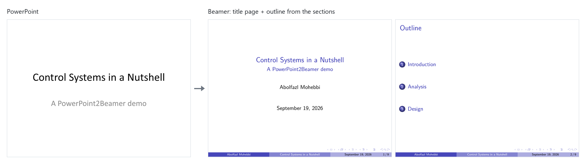
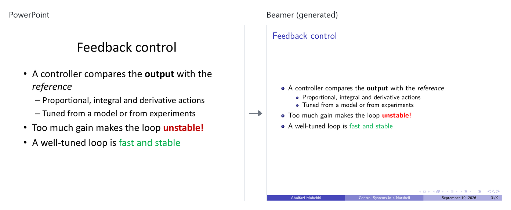
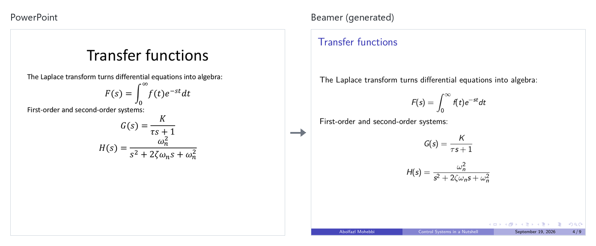
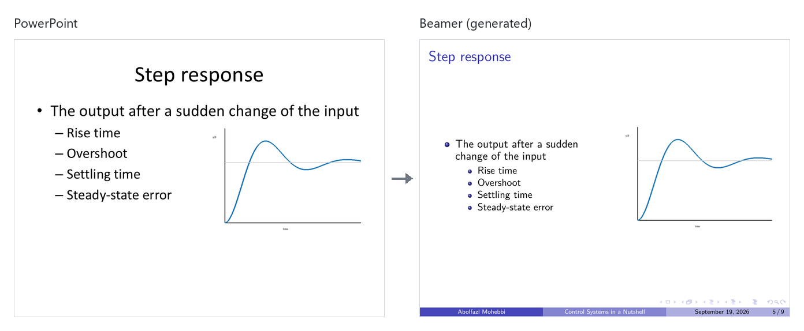
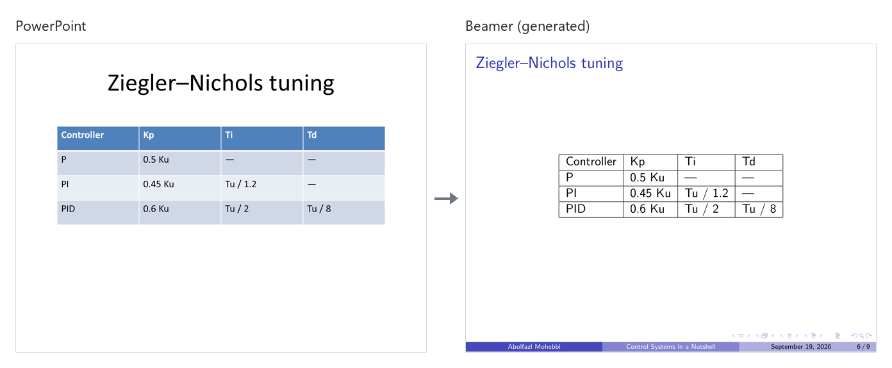
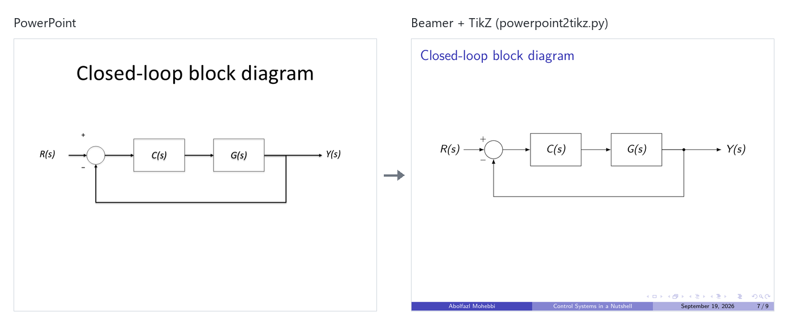
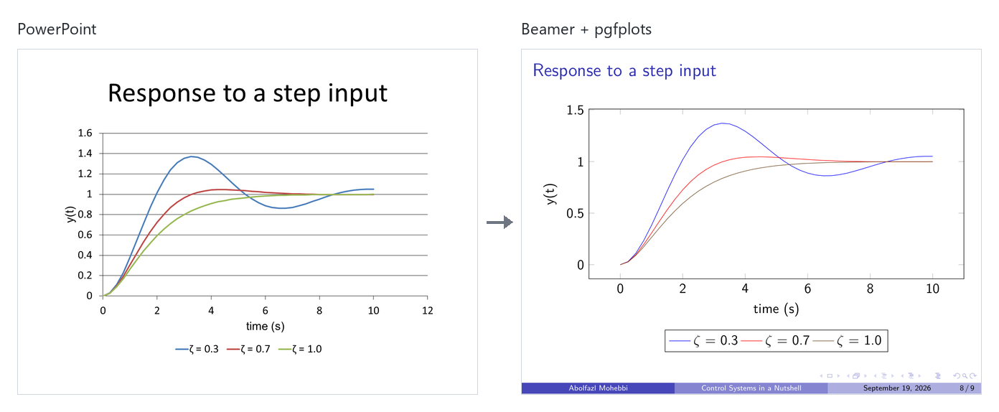
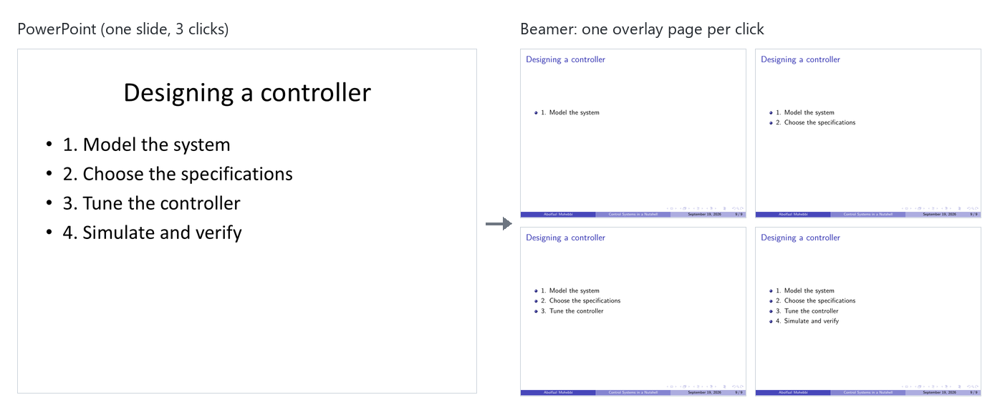

# PowerPoint2Beamer

Two small Python scripts that turn a PowerPoint presentation (`.pptx`) into a LaTeX Beamer presentation.

| Script | What it does |
|---|---|
| `powerpoint2beamer.py` | Converts the whole presentation to Beamer. |
| `powerpoint2tikz.py` | Optional. Redraws the block diagrams on the slides you choose in TikZ, so you can edit them in LaTeX. |

---

## See it in action

These screenshots come from the demo deck in [`examples/`](examples/), converted with one command and compiled with no manual edits. The PowerPoint slide is on the left, and the Beamer result is on the right.

**Title page, and an outline built from the PowerPoint sections**



**Bullets, bold, italic and colour.** Red text becomes `\alert{}`; other colours are kept.



**Equations from PowerPoint's equation editor become real LaTeX math**



**Pictures, with the text beside them as in PowerPoint**



**Tables**



**Block diagrams redrawn as editable TikZ** (`powerpoint2tikz.py`)



**Native charts become pgfplots**



**Click animations become Beamer overlays**



To reproduce the demo:

```bash
python examples/make_demo.py
python powerpoint2beamer.py examples/demo.pptx -o examples/demo_beamer --compile
python powerpoint2tikz.py examples/demo.pptx --slides 6 --project examples/demo_beamer
```

The result, with its PDF, is in [`examples/demo_beamer/`](examples/demo_beamer/).

---

## 1. Install (once)

You need Python 3. Then run:

```bash
pip install -r requirements.txt
```

PowerPoint is optional. On Windows, if PowerPoint is installed, it is used to turn drawn diagrams into images.

---

## 2. Convert a presentation

```bash
python powerpoint2beamer.py "My Talk.pptx"
```

This creates a folder called `My Talk_beamer`:

```
My Talk_beamer/
├── main.tex            ← compile this file
├── slides/
│   ├── slide_1.tex     ← one file per slide
│   ├── slide_2.tex
│   └── ...
└── images/
    ├── slide_2_image_1.png   ← pictures, video previews and diagrams
    └── ...
```

Compile `main.tex` with `pdflatex` or on Overleaf.

### Useful options

| Option | Example | Meaning |
|---|---|---|
| `-o` | `-o Talk` | Name of the output folder. |
| `--theme` | `--theme Warsaw` | Beamer theme. The default is `Madrid`. |
| `--color` | `--color beaver` | Colour theme. The default, `auto`, picks the Beamer colours closest to your slides; `exact` uses your slides' own main colour. |
| `--compile` | | Compile the result into `main.pdf`, report any error with its slide file and line, and fix slides that are too full. |
| `--sections` | `--sections none` | Where `\section`s come from. The default, `auto`, uses PowerPoint sections, then "Section Header" slides, then numbered titles like `2.1 ...`. |
| `--no-outline` | | Don't add an outline slide after the title slide. |
| `--language` | `--language french` | Language for hyphenation and dates. The default, `auto`, detects it from the slides. |
| `--no-render` | | Don't use PowerPoint to draw diagrams; keep only their text. |
| `--list-themes` | | Show all theme names. |

Example:

```bash
python powerpoint2beamer.py "My Talk.pptx" -o Talk --theme Warsaw --color exact --compile
```

To change the style later, just edit the `\usetheme{...}` and `\usecolortheme{...}` lines in `main.tex`.

`--compile` needs a LaTeX engine: `pdflatex` (TeX Live or MiKTeX), `latexmk`, or [Tectonic](https://tectonic-typesetting.github.io).

### What gets converted

- **Titles and bullet lists**, with bold, italic and links.
- **Coloured text**: red text becomes `\alert{...}`; other colours are kept. Equations are always black.
- **Equations** made with PowerPoint's equation editor become real LaTeX math.
- **Click animations** become Beamer overlays, so bullets and pictures appear one click at a time, as in PowerPoint.
- **Sections** become `\section`s, with an outline slide.
- **Charts** (line, bar, column, scatter) become pgfplots charts in `charts/slide_i_chart_j.tex`. Other chart types are saved as images.
- **Pictures**, saved as `slide_i_image_j`.
- **Videos**: only their preview image is kept.
- **Tables**. Wide tables are scaled to fit.
- **Drawn diagrams** (boxes and arrows) are saved as images.
- **Speaker notes**.
- **Slides that are too full** get `[shrink]`, or are split over several frames (`[allowframebreaks]`).

SmartArt is not converted. A `% skipped` comment shows where it was.

---

## 3. (Optional) Redraw block diagrams in TikZ

After step 2, you can replace diagram images with TikZ drawings that you can edit. Give the slide numbers:

```bash
python powerpoint2tikz.py "My Talk.pptx" --slides 21,22,50 --project "My Talk_beamer"
```

You can also give slide file names, for example `--slides slide_21.tex slide_22.tex`.

For each chosen slide:

- The diagram is written to `diagrams/slide_i_diagram_j.tex`.
- In `slides/slide_i.tex`, the image line is commented out and the TikZ diagram is used instead:
  ```latex
  % \includegraphics[width=0.81\linewidth]{slide_50_image_1}
  \input{diagrams/slide_50_diagram_1}
  ```
  To go back to the image, swap which of the two lines has the `%`.
- To change the look of all diagrams at once (line widths, box sizes, arrows), edit `diagrams/tikzstyles.tex`.

It works for block diagrams (blocks, summing junctions with +/−, feedback loops) and flowcharts. Diagrams that contain a picture are skipped.

---

## Tips

- Slide `i` in PowerPoint is `slides/slide_i.tex` in the Beamer project.
- If a slide is too full in Beamer, edit its `slides/slide_i.tex` file. Each file is short and simple.
- If you run into a LaTeX error, the message names the slide file and line number to look at.

---

## Author

**Abolfazl Mohebbi, PhD., P. Eng.**
Professor in Mechanical and Biomedical Engineering
Polytechnique Montréal
[abolfazl.mohebbi@polymtl.ca](mailto:abolfazl.mohebbi@polymtl.ca)

## License

MIT. See [LICENSE](LICENSE).
